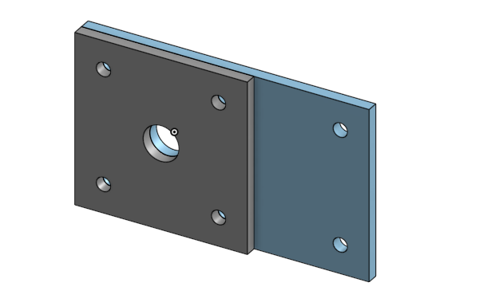

# Basic_Onshape_Cad# BasicCAD

This is Nicholas Casarez.

---
## Table of Contents
* [Table of Contents](#Table-of-Contents)
* [Base](#Base)
* [Mount](#Mount)
* [Fork](#Fork)
* [Tire](#Tire)
* [Wheel](#Wheel)
* [AxleCollarBearings](#AxleCollarBearings)

## Base

### Description

The first assignment is to create the base.  The base's dimensions are 200 mm x 120 mm and 8 mm thick.  It has 6 holes 10 mm wide and 20 mm from the edge equally spaced along the edges.

### Evidence
[The Base in Onshape]https://cvilleschools.onshape.com/documents/a98b0166a06efce87955932e/w/57d1081c5b62e858ed0ccb7a/e/502173d659419a912f06f41f

### Image

### Reflection

This was my first Onshape part and [following along with Dr. Shields made it super easy.](https://www.youtube.com/watch?v=93BFUD-HAG8&feature=emb_title&scrlybrkr=5670f0b4)  I learned about 
* sketching (shortcut **shift-s**)
* constructions lines (shortcut **Q**)
* dimensions (shortcut **D**)
* extruding both add and remove (shortcut key **E**)
* linear patterns (no shortcut)

Onshape is awesome.  I found it really helpful to rename all my sketches.  I cant wait to do the other parts in onshape.

---

## Mount

### Description

### Evidence

### Image

### Reflection

---

## Fork

### Description

### Evidence

### Image

### Reflection

---

## Tire

### Description

### Evidence

### Image

### Reflection

---

## Wheel

### Description

### Evidence

### Image

### Reflection

---

## AxleCollarBearings

### Description

### Evidence

### Image

### Reflection

---
