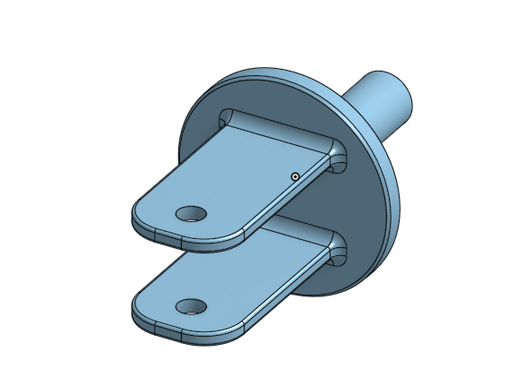
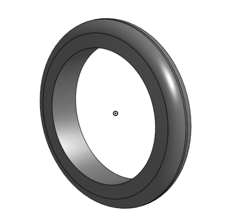

# Basic_Onshape_Cad# BasicCAD

This is Nicholas Casarez.

---
## Table of Contents
* [Table of Contents](#Table-of-Contents)
* [Base](#Base)
* [Mount](#Mount)
* [Fork](#Fork)
* [Tire](#Tire)
* [Wheel](#Wheel)
* [AxleCollarBearings](#AxleCollarBearings)

## Base

### Description

The first assignment is to create the base.  The base's dimensions are 200 mm x 120 mm and 8 mm thick.  It has 6 holes 10 mm wide and 20 mm from the edge equally spaced along the edges.

### Evidence
The Base in Onshape](https://cvilleschools.onshape.com/documents/a98b0166a06efce87955932e/w/57d1081c5b62e858ed0ccb7a/e/502173d659419a912f06f41f)

### Image

### Reflection

This was my first Onshape part and [following along with Dr. Shields made it super easy.](https://www.youtube.com/watch?v=93BFUD-HAG8&feature=emb_title&scrlybrkr=5670f0b4)  I learned about 
* sketching (shortcut **shift-s**)
* constructions lines (shortcut **Q**)
* dimensions (shortcut **D**)
* extruding both add and remove (shortcut key **E**)
* linear patterns (no shortcut)

Onshape is awesome.  I found it really helpful to rename all my sketches.  I cant wait to do the other parts in onshape.

---

## Mount

### Description
The second assignment is the mount you have to use milimeters in this part. You make 120 milimeters on one side than 60 on the other and 200 on the last one put holes with the dimesions in it. Then you extrude cut it throygh all all the circles. Then you go to your base and put the mount and base part  to together then add varbles. Then you want to extrude cut through both parts of every hole that you made.

### Evidence
(https://cvilleschools.onshape.com/documents/a98b0166a06efce87955932e/w/57d1081c5b62e858ed0ccb7a/e/502173d659419a912f06f41f)
### Image

### Reflection
This is part 2 mount. It was really fun to do. Can't wait to do part 3.
---

## Fork

### Description
The third assignment you had to bulid a fork. It wasn't that long to do because it was easy steps. You had to sketch the fork than reflect it on the otner side and then you had to add fliets to the fork. Then you had to extrude cut through all and then you needed to make a circle on the botton of the fork then you were basically done.

### Evidence
(https://cvilleschools.onshape.com/documents/370665a5a62e1b7ac6ca5c53/w/015098721c863aa7d107ea09/e/3e0a18bfe6ff0f0bd5a1a875)

### Image

### Reflection
This was part 3 fork it was very easy and not as long as the other parts. Can't wait to do Part 4
---

## Tire

### Description

The fourth assignment I had to build a tire all I had to do was sketch on a front plane draw a trapzoid. Then had to make consruction lines on a front plane then add dimesions to the trapzoid and consruction lines. Then had to revolve it and then we had to add filets and change the color to grey and it was done.

### Evidence

(https://cvilleschools.onshape.com/documents/fa7b20b67c6d5acce67451c4/w/161cdccfea0cf5e12f0b9b2d/e/d75a56d78690808b8c45fc0a)
### Image

### Reflection
This is part 4 didn't take that long to do. Can't wait to part 5 (wheel) for the tire.
---

## Wheel

### Description
The wheel was very fun to make I had to make 3 rectangles and had to add dimensions. I also had to revovle it and it would be a circle. Then iI had to add filets and extrude and it was basically done.

### Evidence
(https://cvilleschools.onshape.com/documents/a37b70c79cb7aa9d7c321a5f/w/7c0eb8ebaeda211454376290/e/afec890655d2098ee1404061)

### Image

### Reflection
Its was a little bit complicated to do the wheel but that what's engeneering for. Its not always gonna be easy but it was fun because it was challengeing. Onshape is really fun.
---

## AxleCollarBearings

### Description

### Evidence

### Image

### Reflection

---
